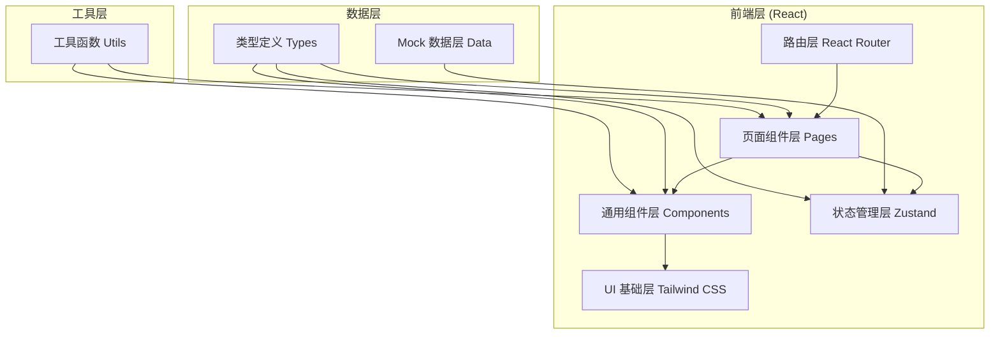
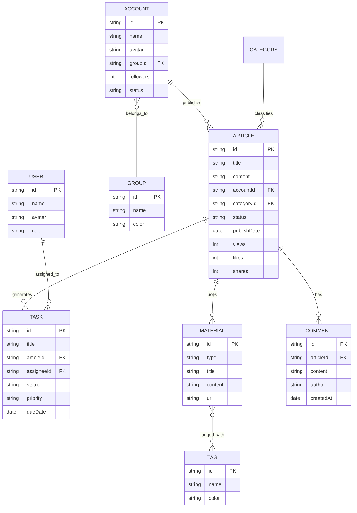

# 公众号矩阵内容管理平台 - 技术架构文档

## 1. 架构设计



---

## 2. 技术描述

- **前端框架**：React 18 + TypeScript 5
- **构建工具**：Vite 5
- **样式方案**：Tailwind CSS 3
- **路由管理**：React Router DOM 6
- **状态管理**：Zustand 4
- **图标库**：Lucide React
- **图表库**：Recharts（轻量级 React 图表库）
- **后端**：纯前端 Mock 数据，无真实后端服务
- **数据持久化**：LocalStorage 用于状态持久化

---

## 3. 路由定义

| 路由路径 | 页面名称 | 说明 |
|----------|----------|------|
| `/` | 账号总览 | 仪表盘首页，矩阵概览 |
| `/overview` | 账号总览 | 同上（别名） |
| `/planning` | 栏目规划 | 日历视图 + 选题池 |
| `/kanban` | 任务看板 | 六列看板任务管理 |
| `/materials` | 素材中心 | 素材库 + 竞品收藏 |
| `/draft` | 智能草稿 | AI 辅助编辑器 |
| `/review` | 审校发布 | 审核 + 发布管理 |
| `/analytics` | 效果分析 | 数据分析仪表盘 |

---

## 4. 数据模型

### 4.1 实体关系图



### 4.2 核心数据类型定义

```typescript
// 账号分组
interface AccountGroup {
  id: string;
  name: string;
  color: string;
}

// 公众号账号
interface Account {
  id: string;
  name: string;
  avatar: string;
  groupId: string;
  followers: number;
  weeklyPosts: number;
  status: 'active' | 'warning' | 'inactive';
  description: string;
  trend: number[]; // 近7天阅读量
}

// KPI 数据
interface KPIData {
  totalFollowers: number;
  weeklyViews: number;
  avgOpenRate: number;
  conversions: number;
  followersChange: number;
  viewsChange: number;
  openRateChange: number;
  conversionsChange: number;
}

// 选题/文章
interface Article {
  id: string;
  title: string;
  summary: string;
  content: string;
  accountId: string;
  category: string;
  status: 'draft' | 'writing' | 'review' | 'scheduled' | 'published' | 'archived';
  priority: 'high' | 'medium' | 'low';
  assignee?: string;
  publishDate?: string;
  dueDate?: string;
  views?: number;
  likes?: number;
  shares?: number;
  conversions?: number;
  goldenQuotes?: string[];
  tags?: string[];
}

// 任务
interface Task {
  id: string;
  title: string;
  articleId: string;
  assignee: string;
  status: 'todo' | 'writing' | 'review' | 'scheduled' | 'published' | 'archived';
  priority: 'high' | 'medium' | 'low';
  dueDate: string;
  progress: number;
}

// 素材
interface Material {
  id: string;
  type: 'image' | 'copy' | 'quote' | 'competitor';
  title: string;
  content?: string;
  url?: string;
  thumbnail?: string;
  tags: string[];
  createdAt: string;
  source?: string;
  views?: number;
}

// 标签
interface Tag {
  id: string;
  name: string;
  color: string;
  count: number;
}

// 审稿意见
interface ReviewComment {
  id: string;
  articleId: string;
  content: string;
  author: string;
  authorAvatar: string;
  type: 'general' | 'inline' | 'brand';
  lineNumber?: number;
  resolved: boolean;
  createdAt: string;
  replies?: ReviewComment[];
}

// 发布记录
interface PublishRecord {
  id: string;
  articleId: string;
  articleTitle: string;
  accountId: string;
  status: 'success' | 'failed' | 'pending';
  scheduledAt: string;
  publishedAt?: string;
  retryCount: number;
  errorMessage?: string;
}

// 用户
interface User {
  id: string;
  name: string;
  avatar: string;
  role: 'admin' | 'editor' | 'reviewer';
}
```

---

## 5. 项目目录结构

```
d:\TraeProjects\1094\
├── src/
│   ├── components/          # 通用组件
│   │   ├── layout/          # 布局组件（Sidebar, Header）
│   │   ├── ui/              # 基础 UI 组件（Card, Button, Badge...）
│   │   └── charts/          # 图表组件
│   ├── pages/               # 页面组件
│   │   ├── Overview.tsx     # 账号总览
│   │   ├── Planning.tsx     # 栏目规划
│   │   ├── Kanban.tsx       # 任务看板
│   │   ├── Materials.tsx    # 素材中心
│   │   ├── Draft.tsx        # 智能草稿
│   │   ├── Review.tsx       # 审校发布
│   │   └── Analytics.tsx    # 效果分析
│   ├── store/               # Zustand 状态管理
│   │   └── useAppStore.ts
│   ├── data/                # Mock 数据
│   │   ├── accounts.ts
│   │   ├── articles.ts
│   │   ├── materials.ts
│   │   └── users.ts
│   ├── types/               # TypeScript 类型
│   │   └── index.ts
│   ├── utils/               # 工具函数
│   │   └── index.ts
│   ├── App.tsx
│   ├── main.tsx
│   └── index.css
├── .trae/
│   └── documents/           # 项目文档
├── index.html
├── package.json
├── vite.config.ts
├── tailwind.config.js
├── postcss.config.js
└── tsconfig.json
```

---

## 6. 状态管理设计

Zustand Store 按功能模块划分：

```typescript
interface AppState {
  // 账号模块
  accounts: Account[];
  groups: AccountGroup[];
  selectedGroupId: string | null;
  
  // 任务/文章模块
  articles: Article[];
  tasks: Task[];
  
  // 素材模块
  materials: Material[];
  tags: Tag[];
  selectedMaterialType: string;
  
  // 审校模块
  reviewComments: ReviewComment[];
  publishRecords: PublishRecord[];
  
  // 用户
  users: User[];
  currentUser: User;
  
  // Actions
  setSelectedGroup: (id: string | null) => void;
  updateTaskStatus: (taskId: string, status: Task['status']) => void;
  claimArticle: (articleId: string, userId: string) => void;
  addMaterialTag: (materialId: string, tagId: string) => void;
  addReviewComment: (comment: Omit<ReviewComment, 'id' | 'createdAt'>) => void;
  retryPublish: (recordId: string) => void;
}
```

---

## 7. 技术要点

1. **响应式设计**：使用 Tailwind 响应式前缀（`md:`, `lg:`）实现多端适配
2. **代码分割**：按页面拆分，避免单文件过大，每个组件 < 300 行
3. **动画方案**：CSS transition + Tailwind animate 类实现轻量动画
4. **图表渲染**：Recharts 库渲染数据可视化，支持交互
5. **状态持久化**：Zustand + localStorage 中间件保存状态
6. **类型安全**：全链路 TypeScript，禁止 any 类型
7. **组件复用**：提取 Card、Badge、StatCard 等通用组件
