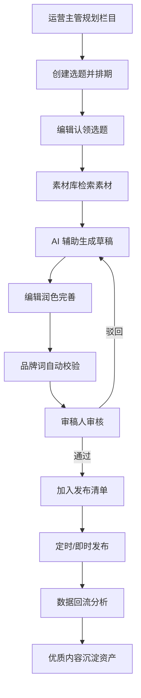
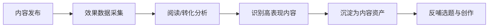

# 公众号矩阵内容管理平台 - 产品需求文档

## 1. 产品概述

面向多品牌公众号矩阵运营团队的一站式内容生产与管理平台，解决多账号协同效率低、内容质量难把控、数据分散难复盘的痛点。通过 AI 辅助写作、工作流协同和数据驱动决策，帮助运营团队实现规模化、标准化的内容生产闭环。

---

## 2. 核心功能

### 2.1 用户角色

| 角色 | 核心权限 |
|------|----------|
| 运营主管 | 全账号管理、栏目规划、数据总览、审核权限 |
| 内容编辑 | 选题认领、草稿撰写、素材使用、提交审核 |
| 审稿人 | 内容审核、品牌词校验、发布审批、意见反馈 |

### 2.2 功能模块

1. **账号总览**：矩阵账号状态概览、分组管理、核心指标仪表盘
2. **栏目规划**：栏目日历视图、选题池管理、选题认领、排期编排
3. **任务看板**：看板式任务流转、状态追踪、负责人分配、截止提醒
4. **素材中心**：图片/文案/金句素材库、打标签分类、竞品文章收藏
5. **智能草稿**：标题批量生成、开头改写、金句提炼、配图占位、排版预览
6. **审校发布**：品牌词校验、审稿意见、发布清单、失败重试记录
7. **效果分析**：阅读转化对比、内容资产沉淀、趋势分析、账号对比

### 2.3 页面详情

| 页面名称 | 模块名称 | 功能描述 |
|----------|----------|----------|
| 账号总览 | 账号卡片 | 展示各公众号头像、名称、粉丝数、本周发文数、状态 |
| 账号总览 | 分组筛选 | 按品牌/业务线/地区分组切换，支持新建分组和账号分配 |
| 账号总览 | 指标仪表盘 | 总粉丝数、7日阅读量、平均打开率、转化数等核心 KPI |
| 账号总览 | 发文趋势 | 近30天各账号发文数量和阅读趋势折线图 |
| 栏目规划 | 栏目日历 | 月/周视图日历，可视化展示已排期选题，拖拽调整日期 |
| 栏目规划 | 选题池 | 待认领选题列表，含标题、栏目、预估发布日期、优先级 |
| 栏目规划 | 选题认领 | 编辑可一键认领选题，支持多人协作分工 |
| 栏目规划 | 排期管理 | 创建/编辑排期，关联账号、栏目、作者、截止时间 |
| 任务看板 | 看板列 | 待撰写/撰写中/待审核/待发布/已发布/已归档 六列看板 |
| 任务看板 | 任务卡片 | 展示标题、账号、负责人、优先级、截止日期、进度标签 |
| 任务看板 | 拖拽流转 | 卡片可在列间拖拽，自动更新任务状态 |
| 任务看板 | 筛选搜索 | 按账号、负责人、优先级、关键词筛选任务 |
| 素材中心 | 素材分类 | 图片、文案、金句、竞品文章四大分类 Tab |
| 素材中心 | 标签系统 | 多级标签筛选，支持素材打多个标签，热门标签云 |
| 素材中心 | 素材上传 | 批量上传图片，粘贴文案，支持 AI 智能打标签 |
| 素材中心 | 竞品收藏 | 收藏竞品公众号文章，自动提取标题、摘要、阅读数 |
| 智能草稿 | 标题生成 | 输入关键词，AI 批量生成10+备选标题，一键选用 |
| 智能草稿 | 开头改写 | 提供多种风格（故事型/数据型/悬念型）自动改写文章开头 |
| 智能草稿 | 金句提炼 | 从长文中自动提取金句，生成金句卡片 |
| 智能草稿 | 配图占位 | 根据文章段落自动插入图片占位符，支持替换为素材库图片 |
| 智能草稿 | 排版预览 | 多种公众号排版模板实时预览，支持一键套用 |
| 审校发布 | 品牌词校验 | 自动扫描文章中的品牌敏感词，高亮标红并给出替换建议 |
| 审校发布 | 审稿意见 | 支持行内评论、整体意见、评分，意见追踪与回复 |
| 审校发布 | 发布清单 | 批量选择待发布文章，设置定时发布，关联多账号分发 |
| 审校发布 | 重试记录 | 发布失败自动记录原因，支持一键重试，查看重试日志 |
| 效果分析 | 阅读转化 | 展示阅读量、在看数、分享数、转化漏斗对比图表 |
| 效果分析 | 账号对比 | 多账号同维度数据对比雷达图，识别头部和尾部内容 |
| 效果分析 | 内容资产 | 高阅读/高转化文章自动沉淀为爆款库，支持复用推荐 |
| 效果分析 | 趋势分析 | 周/月/季度发文趋势与效果趋势，自动生成数据洞察 |

---

## 3. 核心流程

### 3.1 内容生产主流程

### 3.2 数据反馈循环

---

## 4. 用户界面设计

### 4.1 设计风格

**设计方向：编辑室质感 + 数据专业感**

采用「深炭灰 + 墨绿」的专业编辑工具配色，搭配暖铜色作为数据高亮，营造内容工作室的质感。界面采用左右栏布局，左侧为功能导航，右侧为主工作区，确保大量内容操作时的信息密度和操作效率。

- **主色**：墨绿 `#1F5140` — 代表专业、内容、沉淀
- **辅色**：暖铜 `#C68B59` — 代表数据、高亮、创意
- **背景**：炭灰 `#1A1D21` 配浅灰 `#F5F3EE`（浅色模式）
- **文字**：主文字 `#1A1D21`，次文字 `#5C6670`，辅助文字 `#8A94A0`
- **字体**：标题使用「思源宋体」体现编辑质感，正文使用「Inter」保证可读性
- **按钮**：圆角 6px，主要按钮墨绿填充配白字，次要按钮描边配深字
- **图标**：Lucide 线性图标，统一 18px 尺寸
- **卡片**：圆角 12px，浅投影，hover 时投影加深 + 轻微上浮

### 4.2 页面设计概览

| 页面名称 | 模块 | UI 要点 |
|----------|------|---------|
| 账号总览 | 仪表盘 | 大号 KPI 数字配微涨幅，铜色数据高亮，趋势图用平滑渐变填充 |
| 账号总览 | 账号卡片 | 卡片网格布局，头像+名称+状态标签，底部迷你趋势条 |
| 栏目规划 | 日历 | 月视图大日历，日期格内显示选题摘要卡片，优先级用颜色边框区分 |
| 栏目规划 | 选题池 | 列表式卡片，含认领按钮和进度指示条 |
| 任务看板 | 看板 | 6 列横向滚动看板，卡片紧凑信息密度高，拖拽时有吸附动画 |
| 素材中心 | 素材库 | 瀑布流图片 + 列表文案混合布局，标签云置顶悬浮 |
| 智能草稿 | 编辑器 | 左右分栏：左编辑区，右 AI 工具面板 + 实时排版预览 |
| 智能草稿 | AI 面板 | 功能卡片堆叠，每个工具配独立操作区和结果展示 |
| 审校发布 | 校验区 | 红黄绿三色标记，行内批注气泡，右侧审稿意见时间线 |
| 效果分析 | 图表 | 深色图表背景配铜色数据线，多账号用不同层次绿色区分 |

### 4.3 响应式

- **桌面端**（≥1280px）：完整双栏布局，左侧 240px 导航，右侧工作区
- **平板端**（768-1279px）：导航折叠为图标栏，工作区自适应
- **移动端**（<768px）：底部 Tab 导航，卡片单列堆叠，图表简化展示

---

## 5. 交互与动效

- **页面加载**：导航栏先出现，主内容区域错落 fade-in（50ms 间隔）
- **卡片 hover**：上浮 2px + 投影加深，过渡 200ms ease-out
- **看板拖拽**：半透明虚影跟随，目标列高亮，放下时弹性归位
- **AI 生成**：打字机效果逐字输出，进度条微光流动
- **数据更新**：数字滚动动画（count-up），图表数据点呼吸效果
- **状态切换**：任务状态标签颜色渐变过渡，审核通过时对勾描边动画
